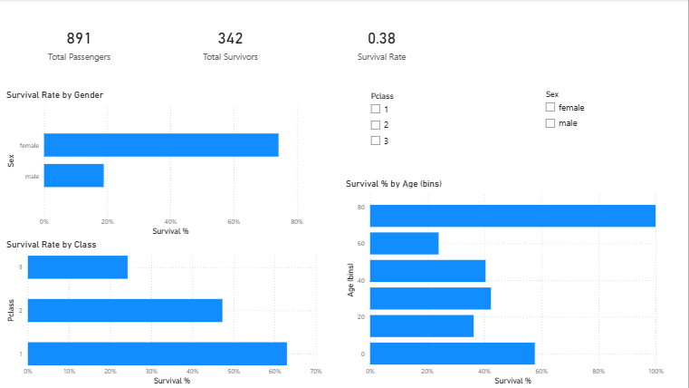

# 🚢 Titanic Survival Analysis | Python + Power BI

This project analyzes passenger survival patterns from the Titanic disaster using **Python (EDA)** and a **Power BI dashboard**.

---

## 🎯 Project Objective

To understand which passenger groups had higher chances of survival by analyzing:
- Gender
- Passenger Class
- Age Groups

---

## 🧠 Skills Used
- Python (Pandas, Matplotlib)
- Data Cleaning & Feature Engineering
- Power BI Dashboard Design
- Data Storytelling

---

## 📊 Key Insights

| Factor | Insight |
|-------|--------|
| **Overall Survival** | Only **38.38%** passengers survived |
| **Gender Impact** | **74% of females** survived vs **19% of males** |
| **Class Impact** | **1st-class** passengers had **63% survival**, 3rd-class only **24%** |
| **Age Impact** | **Children** had highest chance of survival |

➡️ “Women & children first” protocol strongly influenced results

---

## 🖥️ Dashboard Preview

> 📌 Power BI Dashboard screenshot

---

## 📂 Folder Structure

TitanicSurvivalAnalysis/
│
├── data/
│ └── titanic.csv
│
├── python/
│ └── eda.py
│
├── images/
│ └── dashboard.png
│
├── pbix/
│ └── TitanicSurvivalDashboard.pbix
│
└── README.md

---

## 🧪 Python Analysis Code

Located in `python/eda.py`  
Includes:
- Missing value handling
- Encoding gender
- Survival rate calculations
- Visual charts saved automatically

---

## 🛠 Tools Used
| Tool | Purpose |
|------|---------|
| Python | Data cleaning & EDA |
| Power BI | Visualization & Reporting |
| GitHub | Version control |

---

## 💡 Business Learnings

- Female passengers and children were prioritized during rescue
- Economic status (First class) influenced survival probability
- People aged 17–30 were less protected than children and seniors

---

## 👏 Author

**Sanjay Kumar**  
🔗 GitHub: https://github.com/Sanjay1318  

